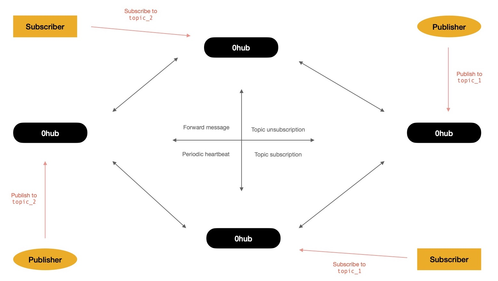
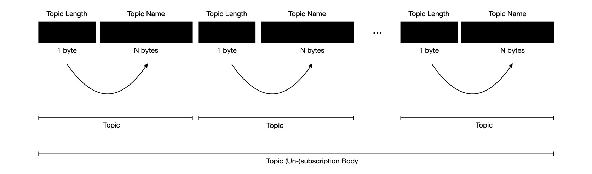
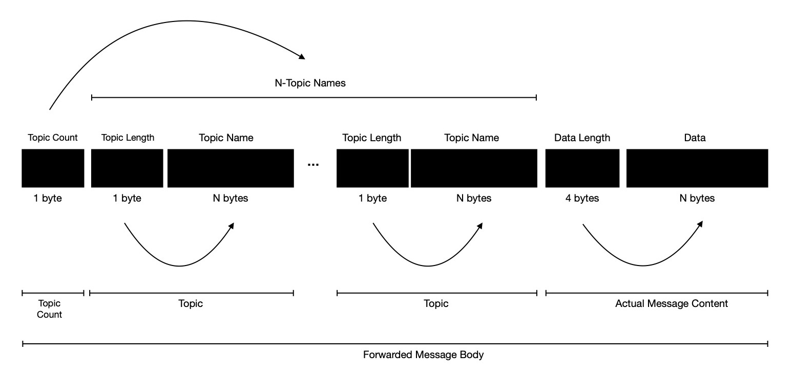

Sometime ago I started working on `pub0sub` - _Fast, Light-weight, Ordered Pub/Sub System_ --- built on top of async I/O, leveraging power of kernel event loop.

The main idea behind it was to write a software ( along with SDK ) which can be used for publishing arbitrary length binary messages to N-many topics; subscribing to N-many topics --- listening for messages published on each of them; and last but not least one powerful Pub/Sub Hub ( i.e. Router ) which will easily solve C10K by leveraging power of async I/O.

The aforementioned problem statement is solved, which is why I decided to update problem statement. Now it looks like `pub0sub` - _Distributed, Fast, Light-weight, Ordered Pub/Sub System_ --- solving C1M easily while leveraging power of kernel event loop & p2p networking.

By making `pub0sub` distributed, I get to handle 1M concurrent connection where nodes form a mesh network for chatting about topic interest(s) & forward messages when need to --- a collaborative effort among peers. I choose to use `libp2p` for networking purpose, for being so modular --- enabling easy horizontal scalability, while taking care of stream multiplexing, security, peer-discovery etc.

Here I propose primary design of system !

Multiple `pub0sub` nodes can discover & connect to each other using DHT ( distributed hash table ) powered peer discovery mechanism, built right into `libp2p` and eventually form a mesh network. If network has N participant(s), each participant is going to maintain connection with other N-1 peer(s), where N > 0. These participants of p2p network are going to chat with each other over bi-directional stream. Things nodes need to talk about 👇

Operation | Interpretation
:--- | ---:
Topic subscription | Letting peers know of interest in some topics
Topic subscription ACK | Peer saying it has noted down & will forward published messages if sees any
Topic unsubscription | Peer saying it has removed entry & will no more forward published messages
Topic unsubscription ACK | Peer saying it has removed entry & will no more forward published messages
Published message forwarding | Passing published message to interested peer
Periodic heartbeat | Network health check

As each of aforementioned operations require to pass different message formats, I'm going to define respective wire formats. But before I get into wire format, writing to/ reading from stream
I'd like to spend some time in going through high level overview of network operation.

Say, two nodes form a cluster --- one node has a _topic_1_ subscriber connected to it while other one has a publisher connected to it, willing to publish message on _topic_1_. After
first node finds out, it has one subscriber interested in messages from _topic_1_, it decides to ask its peer `0hub` node, if it sees any message targeted to _topic_1_, it should inform requester. Publisher sends publish intent to network, which triggers event saying network has received some message on _topic_1_ for which first node has interested subscriber. Two nodes chat over p2p network, resulting into message forwarding, which enables first node
to deliver message published on _topic_1_ to its subscriber.

When noticed carefully, network follows certain protocols

- When subscriber shows interest in _topic_1_, `0hub` broadcasts it to peers
- When publisher publishes message on _topic_1_, `0hub` forwards message to all interested peers

Let's take another scenario.

Continuing previous scenario, after sometime subscriber doesn't anymore want to receive messages published on _topic_1_, so it sends unsubscription intent to network. As a result of it, respective `0hub` node decides to broadcast same to network, because it found it doesn't have any other subscribers who're interested in messages of _topic_1_. All peers who kept record of this node being interested in _topic_1_, updates their respective interest table, ensuring when in future it receives message published on _topic_1_, it won't forward to first peer.

This way of showing interest to topics when peers has some subscribers to feed or announcing not interested anymore when all subscribers of certain topic unsubscribes --- allows network to pass published messages only when needed, eventually consuming lower bandwidth. I call it **Lazy Pushing**.

With more peers, network interaction may look like 👇 from high level, where `0hub` nodes form p2p mesh network, other participants are mere clients.

Say, one subscriber shows interest in receiving messages from _{topic_1, topic_2, topic_3}_ but the `0hub` node it's connected to doesn't have any publisher of any of those topics. As soon as `0hub` node learns it has subscriber
to feed messages of _{topic_1, topic_2, topic_3}_, following protocol it announces that intent to other peers. Each of other peers record it & as soon as they receive any message published on any of these topics they forward those to respective peers.

I'll now spend some time in specifying wire-format of messages exchanged between peers.

Each message exchanged between peers over p2p layer, needs to have two parts

- Header ( 5 bytes )
- Body ( N bytes )

Just by reading header part receiver must be able to understand two things

- What kind of operation is it ?
- How many more bytes to read from stream for consuming message body ?

First question can be answered by checking very first byte of message. Each operation is denoted by unique opcode. There're 255 possible opcodes, though only 6 of them are in use as of
now.

Interpretation | Opcode
--- | ---:
Heartbeat | 1
Topic subscription | 2
Topic subscription ACK | 3
Topic unsubscription | 4
Topic unsubscription ACK | 5
Message Forward | 6

By reading next 4 bytes from header, receiver understands how many more bytes it should read from stream so that it can successfully deserialise message, depending upon opcode. Each opcode denotes
different message wire-format, resulting into invocation of different deserialisation logic upon reception.

Above is a high level wire-format, which is applicable for each of messages. But I'd like to define how **BODY** of message is serialised/ deserialised for different opcodes. Starting
with how it looks like when announcing interest in listening to some topics.

Note, above image is nothing but magnification of message **BODY** when opcode ∈ {2, 4}. Requirement is peer needs to announce it wants to receive all messages published on topics, because it has
some subscribers interested in those. Receiver side when reading from stream, knows how many bytes it needs to read from stream for completely consuming **BODY**.

It starts by reading first 1-byte, where it has instruction encoded how many next bytes it should read for making one meaningful topic name. Now it has either consumed all bytes of **BODY**
or some of them are left. If left, it'll again consume 1-byte, carrying instruction for it for figuring out what's next topic name. This way, it'll keep reading until it has exhausted all bytes
of **BODY**. By the end it must have successfully constructed structured object in respective environment, containing topics some peer want to get notified of.

Similar wire-format is followed for serialising **BODY** when announcing lack of interest in some
topics.

Both of aforementioned opcodes, expect to hear back with ACK messages i.e. opcode ∈ {3, 5}, where **BODY** can be encoded by putting binary value denoting success/ failure. These are expected to be received with in a stipulated time window after interest ( opcode 2 ) / lack of interest ( opcode 4 ) message is sent to peer. If not received, for opcode 2, it'll be resent upto N-times. If still not received, it results into connection termination with peer for not following protocol.

But if peer is waiting for ACK of message with opcode 4, it doesn't resend, because of being low priority. Of course it might result into network wasting some bandwidth for passing some published message which could have been avoided. If any forwarded message
from any topic to which peer is not interested in, is received even after lack of interest message was broadcast ( opcode 4 )
it can be ignored by receiver. Receiving peer also sends another message to respective peer with opcode 4, stating it's not interested in these topics --- just like repeating self. This is done so that next time network can save some bandwidth.

Finally I'll cover how to serialise/ deserialise forwarded message to/ from stream.

Start by reading first byte of **BODY**, which encodes how many topics this message is being targeted to. A message can be targeted to 255 topics at max. Receiver knows how many topics it should be reading from stream. So it starts by reading next 1 byte, encoding first topic's byte length. It knows how many next bytes to be read for figuring out first topic name. It has just read one topic name. Similarly it'll continue reading more topic names until all are read off. After N topic names are read, it'll read 4 bytes, encoding how many next bytes it needs to read for extracting out actual message content.

Eventually it'll reach end, constructing structured data by consuming stream. This is how forwarded messages are recovered from stream by some peer who showed interest in getting notified when some message is published on topics of interest. After getting structured data, receipient `0hub` node can send message to subscribers connected to it directly, interested in any of topics this message is published on.

**Reader may notice**, a slight difference in encoding variable number topic list, between previous two diagrams. When encoding to be forwarded message ( opcode 6 ), peer encodes topic count in first 1-byte of **BODY** part of message. This is required, otherwise during deserialisation receiver won't be able to understand where in stream it should stop reading topic names & start reading 4-byte lengthy actual message content's length field.

But same is not required for message sent with opcode ∈ {2, 4}, because there's nothing more to read after topic name list and receiver already knows length of **BODY** part of message, so it knows how long to read from stream.

Let's go through one example

Say `0hub` peer want to announce its interest in messages published on _topic_1_, _topic_2_. Serialised message for this operation looks like

Message Part | Field Name | Field Byte Length | Field Value
--- | :-: | ---: | ---:
Header | Opcode | 1 | 2
Header | Body Length | 4 | 16
Body | Topic-1 Length | 1 | 7
Body | Topic-1 Name	| 7 | topic_1
Body | Topic-2 Length | 1 | 7
Body | Topic-2 Name	| 7 | topic_2

21 bytes of data to be sent to each peer, resulting into (N-1) * 21 bytes of data broadcast in total, where N > 0 & N is #-of participants in mesh network.

Similarly by following aforementioned example, message of lack of interest to topics ( opcode 4 ) can be published on network.

Finally I'll go through one last example showing serialisation of to be forwarded message i.e. opcode 6. Assuming this message is published on _topic_1_, _topic_2_ & content of message is _hello_.

Message Part | Field Name | Field Byte Length | Field Value
--- | :-: | --: | --:
Header | Opcode | 1 | 6
Header | Body Length | 4 | 26
Body | Topic Count | 1 | 2
Body | Topic-1 Length | 1 | 7
Body | Topic-1 Name | 7 | topic_1
Body | Topic-2 Length | 1 | 7
Body | Topic-2 Name | 7 | topic_2
Body | Data Length | 4 | 5
Body | Data | 5 | hello

This results into sending 31 bytes of data to each of those peers who showed interest to _topic_1_, _topic_2_. Not to all N-1 remaining participants of mesh network --- **Lazy Pushing** at work.

Peers need to periodically send heartbeat messages for checking health of long-lived network connections to other peers. Opcode 1 is reserved for this purpose, where **BODY** of message ∈ {ping,pong}.

If reader has covered whole proposal, they probably understand this is by no means a final version of design. Improvements like not forming strongly connected mesh helps in reducing huge bandwidth cost --- can be taken into consideration to further
enhance protocol. Message authentication can be added so that peers only accept connection request from other peers who are trusted, when such setup is desired.

Existing pub0sub implementation is <a target="_blank" href="https://github.com/itzmeanjan/pub0sub">here</a>.

Your feedback will be invaluable. Have a great time !
