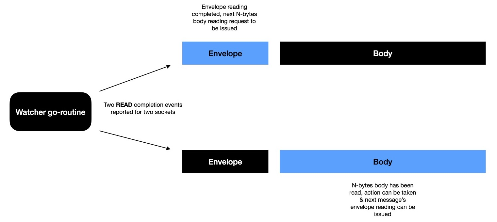
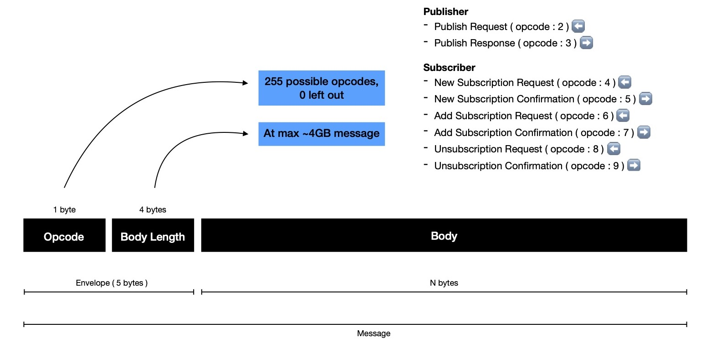
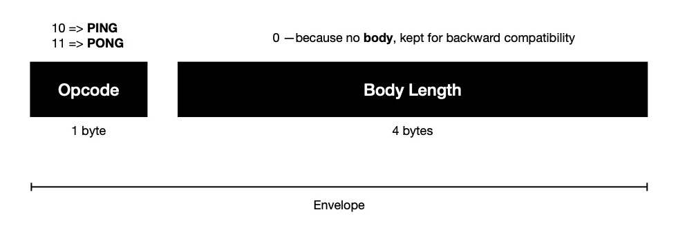

# Sound of Heartbeat over TCP

Created : June 06, 2021

---

Few weeks back I started working on `pub0sub` - Fast, Light-weight, Ordered Pub/Sub System, leveraging power of kernel event loop, addressing C10K while running on a consumer grade machine.

`pub0sub` can easily handle > 10k concurrent connections even on consumer grade machine, because it doesn't follow conventional way of writing TCP servers in Go. Generally, one go-routine accepts TCP connection & spawns new go-routine for handling connection throughout its lifetime. This way if objective is to handle > 10k concurrent connections, there're > 10k go-routines. Go scheduler needs to perform expensive context switching for running go-routines on underlying OS threads. For > 10k go-routines cost of context switching is pretty high, when no useful task gets accomplished. Also stack memory requirement for > 10k go-routines is not something neglectable.

Avoiding aforementioned path helps in discovering another potential way, where I can ask kernel event loop to watch file descriptors of interest & only inform when some action need to be taken. At a time any of two completion events can happen on socket { **READ**, **WRITE** } --- either pre-scheduled reading or writing from socket has been completed, giving opportunity to act on it & schedule next operation. There's no more > 10k go-routines, rather only 2 go-routines --- one used for listening & accepting TCP connections; another for watching & responding to I/O events. 

It'll be perfectly okay to add more watcher go-routines ( static, done at system startup phase ), each managing its own kernel event loop and watching some delegated sockets. But in that case newly accepted connections need to be fairly distributed among all event watching loops otherwise some of them becomes **hotspot**, resulting into performance degradation. Some watcher does more socket watching, some does less. Even it's possible some topics
in pub/sub are popular and all subscribers interested in those topics needs to be distributed across available watchers. For orchestrating N-sockets on available M-watchers, _where N >>> M_, I need to keep additional state information in listener go-routine. It can also be further explored whether dynamic watcher adding/ removing in runtime as per system state brings any improvement or not.

Back to current implementation, as a result, lesser time spent in context switching more time spent doing actual work. As soon as new connection is accepted, it's delegated to watcher. On the other hand watcher waits for I/O completion events &  as soon as some of them are available to act on; it starts looping over them one-by-one --- processing each & scheduling next action on socket.

This model of writing TCP server is performant, but brings in some complexities. Previously I could manage each connection's whole life-cycle in its own go-routine --- seperation of concern was well respected. As a result implementation was easier to reason about.

Say in first model, server has two clients --- each being managed in its own go-routine. Pub/Sub Hub is waiting to read message from respective sockets, where each message has two parts

Part | Size ( in bytes ) | Purpose
--- | --- | ---
Envelope | 5 | Keeps OPCODE, BodyLength
Body | N | Keeps BodyLength -bytes actual data

For one client, go-routine reading envelope and for another one body is being read after envelope reading is done. I'd like to highlight, messages are seperated in two parts because it helps
in determining what's length of variable sized body, where envelope length is fixed at 5-bytes.

But attaining same behaviour when delegating reading from/ writing to sockets to watcher is little more involved.

For reading message envelope, request is issued; watcher informs when envelope is read. Then envelope is deserialised to
figure out how many more bytes to read from socket for consuming message body. N-bytes body reading is again delegated to watcher, which informs as soon as it's done. Now if there're M-clients connected at this moment each of them may be reading any possible part of message. There could be also different kinds of messages --- where OPCODE is encoded in envelope along with body length. Reading handler function needs to remember where it left off last time & what exactly it was doing then, so that it can keep processing later part of message. This calls for additional state keeping --- resulting into more memory allocation than first model.

It's like when first time envelope is read, reading handler function understands what's intention of client and how many more bytes it needs to read from socket to construct message. It puts an entry in **ongoing reading table**, _indexed by socket_, along with OPCODE so that appropriate deserialisation
handler can be invoked when body reading will be completed; issues N-bytes body reading request; moves on to next event processing step.

After sometime when body reading is done on this socket, watcher informs, socket is looked up in **ongoing reading table**
to understand what has happened till now & what to do next with body. And finally intended action is taken on received message and socket entry from **ongoing reading table** is removed.

In `pub0sub` there're two kinds of clients i.e. { publisher, subscriber }. Each of them interact with Pub/Sub server i.e. `0hub` with different intention resulting into different message format. Opcode helps read handler understand how to deserialise message body or what kind of actions to take on deserialised, structured message & how to eventually respond back to client.

With all these pieces Pub/Sub Hub implementation `0hub` shows quite promising performance. I've tested it with 16k concurrent connections on consumer grade machine. I believe if it's tested in containerised environment where virtual overlay networking can be easily used and more ports ( = more clients ) in total are available, `0hub` will break its own record. Some other day I'd like to run that experiment.

Recently I started noticing issue with long lived TCP connections --- resulting into abnormal connection termination. I suspect this is due to long lived TCP connections might be idle for long time if publishers are not publishing often or subscribers have subscribed to some infrequently update receiving topics. To address this situation I plan to add periodic heartbeat message passing between client & hub. Heartbeat messages will be of 5-bytes --- _only envelope, no body_. If there's no body, it denotes last 4-bytes of message envelope will be holding 0, only first byte contains opcode ---  10 for ping, 11 for pong. For maintaining backward compatibility envelope size can't be changed, which is why I'm wasting 4 bytes in envelope by only storing 0.

Every 30 seconds `0hub` sends PING ( opcode = 10 ) message to all connected
publishers & subcribers and expects to hear back with PONG ( opcode = 11 ) message. For all those who responded
back, their next health check to be scheduled at t+30. Others who didn't respond back, they'll be
pinged again upto 3 times at max, each after 30 seconds delay. If they still don't respond back, hub terminates connection
with them while cleaning up all resources associated with respective client.

This will hopefully help hub in maintaining connection & related resources only for healthy & active clients, while enabling it in estimating _how many subscribers to receive published message on a topic_ with better precision. This estimation calculation will pose a challenge during implementing distributed version of `pub0sub` --- which I'll face very soon.

These PING/ PONG messages are simply an overhead, though unavoidable, consuming bandwidth overtime. But I can probably
reduce #-of health checking done. When hub and client has recently communicated for sake of their usual business procedure, it's quite evident connection is active --- health check can be avoided. Idea is to only do health check when hub hasn't heard from client for some time.

If some active publisher sends message publish intent every < 30s, it can avoid explicit health check cost. On other hand subscribers
listening to active topic i.e. frequent update receiving topic, can avoid health check because connection issues will be caught when attempting to push update. That's why I call health check **LAZY**. As each health check message & response wastes 4-bytes for sake of backward compatibility, it's better to keep its usage as low as possible.

Another way I'm looking at --- it's possible to send PING ( opcode = 10 ) message from hub to client of only 1-byte length i.e. OPCODE part of whole message, but when client responds back with PONG ( opcode = 11 ) then need to send only envelope i.e. 5-bytes, as proposed 👆. This way communication pattern becomes somewhat asymmetric, but helps in saving 4-bytes, resulting into health check round-trip with 6-bytes instead of previous 10-bytes.

Current version of `pub0sub` is <a href="https://github.com/itzmeanjan/pub0sub" target="_blank">here</a>.
I'd love to get feedback and have a great time !
