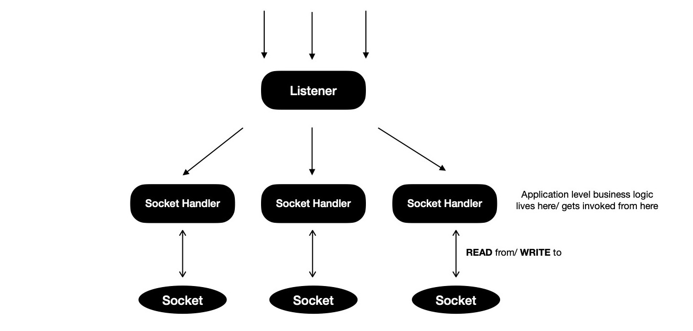
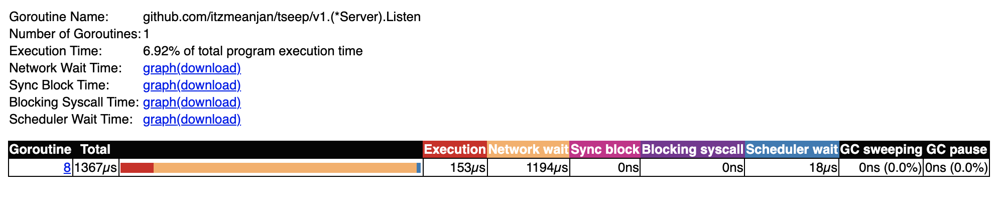
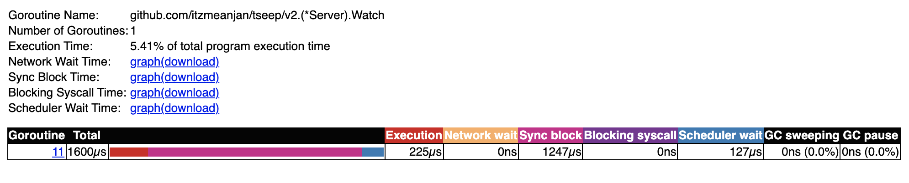

# Speaking TCP

Created : June 13, 2021

---

For last few months I've been working at TCP level more often than I generally do. During this period I designed and implemented few systems where multiple participants talk to each other over TCP while following custom application level protocol. I learned the way most of TCP applications written in ( specifically ) Golang
can be done in a slight different way so that applications don't end up spawning one go-routine per accepted connection --- resulting into thousands of active go-routines when talking to thousands of concurrent peers. Rather than handling each peer in its own go-routine, proactively attempting to read from socket & spending most of its time in blocked mode; keeping only one socket watcher go-routine which is responsible for informing any READ/ WRITE completion event happening on any of delegated sockets --- consumes way lesser resources. It excels at reducing scope of context switching by bringing possible go-routine count to minimal. As a result of it, Golang scheduler only needs to manage a few go-routines now. Previously scheduler had to orchestrate thousands of go-routines on **N** system threads. I ran some experiments
and result was promising --- TCP servers able to easily handle **100k** concurrent connections when following second approach.

Following 3 different approaches, I develop key-value database where clients can send read/ write requests over TCP. I challenge each implementation with **100k** concurrent connections and collect statistics of their performance, resource consumption, execution trace etc. under load; all running on consumer-grade machines in containerised environment i.e. Docker.

- One go-routine per connection
- One watcher for all sockets
- N ( >1 ) watchers for all sockets

The application I develop is quite simple but it captures the essence of a TCP application. It's a remote _( not necessarily geographically )_ in-memory KV database, to which clients connect
over TCP & maintain that connection throughout their life time. During their life time they do any of two possible operations in a randomised manner.

- **READ** - Attempt to read VALUE associated with supplied KEY
- **WRITE** - Attempt to associate VALUE with KEY

In both of the cases clients expect to hear back from server. In response frame VALUE associated with KEY is returned. For WRITE request, VALUE in response frame must be equal to what's sent in request frame. On server side all reading/ writing is done in concurrent safe manner --- by acquiring mutex locks. Only for write request r/w lock is held i.e. _critical section of code_, otherwise normal read-only lock is held --- allowing fulfilment of multiple READ requests concurrently.


For performing desired operations, clients send structured data frames over TCP; server extracts that out from socket; performs action as specified in message envelope i.e. opcode field; responds back with response frame.

Each message sent over wire is two-parts, where envelope carries operation kind i.e. {READ, WRITE} & how many more bytes server need to be read from stream to construct a structured message. Clients
always expect to receive only one kind of frame in response.

- Envelope : 3 bytes
- Body : N ( < 65536 ) bytes

For a READ frame, sent when client is interested in looking up VALUE associated with KEY, body just holds key, preceded with key length in 1 byte field. Notice, body length field in envelope is 2 bytes, allowing at max 65535 bytes of body, but in body actually 256 bytes can be written due to key length field in body being of 1 byte. This is done intensionally for keeping illustration simple.

Practically max READ frame size over wire will be

Field | Max Thoeretical Size ( in bytes ) | Max Practical Size ( in bytes )
--- | --- | ---
Envelope | 3 | 3
Body | 65536 | 256
Total | 65538 | 259


WRITE frame carries little more data, which is sent when client is interested in associating VALUE with some KEY, because it carries both key, value & each of them are preceded with respective length in 1 byte field. Same scene here, practically WRITE frame's body will be at max 512 bytes though it's allowed to be at max 65535 bytes theoretically, as written in body length field in stream.

Limits WRITE frame size will be

Field | Max Thoeretical Size ( in bytes ) | Max Practical Size ( in bytes )
--- | --- | ---
Envelope | 3 | 3
Body | 65536 | 512
Total | 65538 | 515


In response of READ/ WRITE request client expects to receive one RESPONSE frame, where VALUE associated with KEY is encoded, where length of VALUE precedes it, encoded 1 byte --- signaling client how many more bytes to read from stream to construct response. Good thing about response frame, it doesn't waste any space, just allows sending 255 bytes VALUE at max.

Field | Max Thoeretical Size ( in bytes ) | Max Practical Size ( in bytes )
--- | --- | ---
Envelope | 2 | 2
Body | 255 | 255
Total | 257 | 257


Now I'd like to spend some time in specifying how each of 3 approaches work.  For ease of addressing, I'll refer to them from now on as _{**v1** => 1, **v2** => 2, **v3** => 3}_.

Model **v1** is popular way of writing TCP servers in Go, where one listener go-routine keep listening on a _host:port_; accepts connection & spawns new go-routine for handling connection throughout its life time. This model respects seperation of concern well & operations happening on socket are easier to reason about due to clean structure. But one thing to notice, each go-routine alive for handling concurrent connections, spends a lot of its time in blocked state --- proactively waiting to read
from socket.



Model **v2** is slightly different than **v1**, where rather than spawning one go-routine per accepted connection, all accepted connections are delegated to one watcher go-routine, which runs one kernel event loop and learns about READ/ WRITE completion events on sockets being watched. Every now and then event loop informs watcher go-routine of READ/ WRITE completion events, providing with opportunity to take action on accomplished task and schedule next operation on socket asynchronously.

This mode of operation has some similarity with _libuv_ --- which powers NodeJS's event loop.


I'd call model **v3** a generic version of model **v2**, where N-watcher go-routines run N-many kernel event loops and each accepted connection is delegated to one of these available watchers for rest of their life time. Whenever READ/ WRITE completion event ocurrs on some socket, event loop notifies respective watcher go-routine, which invokes _handle{READ,WRITE}_ method
to take action on completed event and schedule next operation on socket, to be completed asynchronously.

Using this model calls for socket orchestrating technique --- connections are fairly distributed among all available watcher go-routines. Goal of orchestration is not creating hot-spots i.e.
some watcher go-routine managing lots of sockets while some has got few. This defeats whole purpose of model **v3**. One naive orchestration technique will be using modular arithmetic, where
M-th accepted connection is delegated to M % N -th watcher go-routine, where M > 0, N > 0, N = #-of watcher go-routines.

One problem I see with this scheme is, assuming peer connections are generally long-lived some watcher might end-up managing all those long-lived peers while some other watcher go-routine
probably received those sockets which were unfortunately not long-lived, will manage few sockets --- creating imbalance in socket watching delegation i.e. hotspot resulting into bad performance. What I think can be done, rather than blindly orchestrating sockets using naive round-robin technique, 
better to keep one feedback loop from watcher go-routines, so that they can inform listener go-routine of their current status i.e. how many delegated sockets are they managing now ?, how many of them are active in terms of READ/ WRITE operation frequency --- rolling average over finite timespan ? etc., allowing listener go-routine to make more informed decision before it delegates accepted connection to some watcher. This brings in management flexibility.


It's time to run these models on real mahine and collect statistics. I've prepared parallel benchmarking testcases, where in each round of benchmarking one client connects to TCP server and sends two frames in order. First frame is read request for some KEY, waits for response, consumes it _( if some other client has already set VALUE for that KEY )_; then it sends write request with a KEY, VALUE pair, waits for response, expecting to see VALUE in response matching what it sent in write request. Each benchmark is performed 8 times, to get average statistics.

I do parallel benchmark of model **v1** on two machines running GNU/Linux & MacOS where for each round takes ~34k ns on GNU/Linux, but it's relatively on higher side when run on MacOS ~45k ns.

```bash
// v1 on GNU/Linux

$ go test -v -run=xxx -bench V1 -count 8
goos: linux
goarch: amd64
pkg: github.com/itzmeanjan/tseep/v1
cpu: Intel(R) Xeon(R) Platinum 8124M CPU @ 3.00GHz
BenchmarkServerV1
BenchmarkServerV1-4   	   34150	     34866 ns/op	  29.63 MB/s	    3750 B/op	      52 allocs/op
BenchmarkServerV1-4   	   34316	     34922 ns/op	  29.58 MB/s	    3750 B/op	      52 allocs/op
BenchmarkServerV1-4   	   33979	     35035 ns/op	  29.48 MB/s	    3750 B/op	      52 allocs/op
BenchmarkServerV1-4   	   33944	     35518 ns/op	  29.08 MB/s	    3750 B/op	      52 allocs/op
BenchmarkServerV1-4   	   33795	     35610 ns/op	  29.01 MB/s	    3750 B/op	      52 allocs/op
BenchmarkServerV1-4   	   33493	     35604 ns/op	  29.01 MB/s	    3749 B/op	      52 allocs/op
BenchmarkServerV1-4   	   33490	     35473 ns/op	  29.12 MB/s	    3749 B/op	      52 allocs/op
BenchmarkServerV1-4   	   33523	     35338 ns/op	  29.23 MB/s	    3749 B/op	      52 allocs/op
PASS
ok  	github.com/itzmeanjan/tseep/v1	12.452s
```

```bash
// v1 on MacOS

$ go test -v -run=xxx -bench V1 -count 8
goos: darwin
goarch: amd64
pkg: github.com/itzmeanjan/tseep/v1
cpu: Intel(R) Core(TM) i5-8279U CPU @ 2.40GHz
BenchmarkServerV1
BenchmarkServerV1-8   	   27030	     47430 ns/op	  21.78 MB/s	    3751 B/op	      52 allocs/op
BenchmarkServerV1-8   	   26208	     44778 ns/op	  23.07 MB/s	    3752 B/op	      52 allocs/op
BenchmarkServerV1-8   	   27098	     43486 ns/op	  23.75 MB/s	    3752 B/op	      52 allocs/op
BenchmarkServerV1-8   	   27368	     44496 ns/op	  23.22 MB/s	    3753 B/op	      52 allocs/op
BenchmarkServerV1-8   	   25234	     49744 ns/op	  20.77 MB/s	    3753 B/op	      52 allocs/op
BenchmarkServerV1-8   	   24418	     49292 ns/op	  20.96 MB/s	    3752 B/op	      52 allocs/op
BenchmarkServerV1-8   	   24998	     47754 ns/op	  21.63 MB/s	    3751 B/op	      52 allocs/op
BenchmarkServerV1-8   	   24969	     47495 ns/op	  21.75 MB/s	    3751 B/op	      52 allocs/op
PASS
ok  	github.com/itzmeanjan/tseep/v1	14.223s
```

For model **v2**, MacOS takes lesser time for each round than it took in model **v1**. But that's not true for GNU/Linux --- rather it almost doubled up.

```bash
// v2 on GNU/Linux

$ go test -v -run=xxx -bench V2 -count 8
goos: linux
goarch: amd64
pkg: github.com/itzmeanjan/tseep/v2
cpu: Intel(R) Xeon(R) Platinum 8124M CPU @ 3.00GHz
BenchmarkServerV2
BenchmarkServerV2-4   	   19852	     60069 ns/op	  34.39 MB/s	    6113 B/op	      71 allocs/op
BenchmarkServerV2-4   	   20102	     60362 ns/op	  34.23 MB/s	    6108 B/op	      71 allocs/op
BenchmarkServerV2-4   	   19983	     59815 ns/op	  34.54 MB/s	    6107 B/op	      71 allocs/op
BenchmarkServerV2-4   	   20096	     59202 ns/op	  34.90 MB/s	    6107 B/op	      71 allocs/op
BenchmarkServerV2-4   	   20307	     59099 ns/op	  34.96 MB/s	    6107 B/op	      71 allocs/op
BenchmarkServerV2-4   	   19944	     60038 ns/op	  34.41 MB/s	    6107 B/op	      71 allocs/op
BenchmarkServerV2-4   	   20209	     58666 ns/op	  35.22 MB/s	    6107 B/op	      71 allocs/op
BenchmarkServerV2-4   	   20170	     58852 ns/op	  35.11 MB/s	    6105 B/op	      71 allocs/op
PASS
ok  	github.com/itzmeanjan/tseep/v2	14.448s
```

```bash
// v2 on MacOS

$ go test -v -run=xxx -bench V2 -count 8
goos: darwin
goarch: amd64
pkg: github.com/itzmeanjan/tseep/v2
cpu: Intel(R) Core(TM) i5-8279U CPU @ 2.40GHz
BenchmarkServerV2
BenchmarkServerV2-8   	   35652	     32646 ns/op	  63.29 MB/s	    6191 B/op	      72 allocs/op
BenchmarkServerV2-8   	   39087	     30548 ns/op	  67.63 MB/s	    6178 B/op	      72 allocs/op
BenchmarkServerV2-8   	   39044	     30425 ns/op	  67.91 MB/s	    6173 B/op	      72 allocs/op
BenchmarkServerV2-8   	   39390	     30321 ns/op	  68.14 MB/s	    6175 B/op	      72 allocs/op
BenchmarkServerV2-8   	   39427	     30540 ns/op	  67.65 MB/s	    6175 B/op	      72 allocs/op
BenchmarkServerV2-8   	   37016	     34478 ns/op	  59.92 MB/s	    6177 B/op	      72 allocs/op
BenchmarkServerV2-8   	   35229	     36566 ns/op	  56.50 MB/s	    6186 B/op	      72 allocs/op
BenchmarkServerV2-8   	   33456	     35525 ns/op	  58.16 MB/s	    6184 B/op	      72 allocs/op
PASS
ok  	github.com/itzmeanjan/tseep/v2	12.866s
```

In case of model **v3**, GNU/Linux and MacOS both of them has kept their trends intact --- for one average benchmark round completion timespan increases, for other it's decreasing, respectively.

```bash
// v3 on GNU/Linux

$ go test -v -run=xxx -bench V3 -count 8
goos: linux
goarch: amd64
pkg: github.com/itzmeanjan/tseep/v3
cpu: Intel(R) Xeon(R) Platinum 8124M CPU @ 3.00GHz
BenchmarkServerV3
BenchmarkServerV3-4   	   15162	     79368 ns/op	  26.03 MB/s	    5713 B/op	      73 allocs/op
BenchmarkServerV3-4   	   15229	     78720 ns/op	  26.24 MB/s	    5715 B/op	      73 allocs/op
BenchmarkServerV3-4   	   14929	     81184 ns/op	  25.45 MB/s	    5713 B/op	      73 allocs/op
BenchmarkServerV3-4   	   15290	     79059 ns/op	  26.13 MB/s	    5713 B/op	      73 allocs/op
BenchmarkServerV3-4   	   14955	     79231 ns/op	  26.08 MB/s	    5713 B/op	      73 allocs/op
BenchmarkServerV3-4   	   15013	     78480 ns/op	  26.33 MB/s	    5713 B/op	      73 allocs/op
BenchmarkServerV3-4   	   14869	     79838 ns/op	  25.88 MB/s	    5713 B/op	      73 allocs/op
BenchmarkServerV3-4   	   15498	     80839 ns/op	  25.56 MB/s	    5713 B/op	      73 allocs/op
PASS
ok  	github.com/itzmeanjan/tseep/v3	15.678s
```

```bash
// v3 on MacOS

$ go test -v -run=xxx -bench V3 -count 8
goos: darwin
goarch: amd64
pkg: github.com/itzmeanjan/tseep/v3
cpu: Intel(R) Core(TM) i5-8279U CPU @ 2.40GHz
BenchmarkServerV3
BenchmarkServerV3-8   	   41614	     28501 ns/op	  72.49 MB/s	    5715 B/op	      74 allocs/op
BenchmarkServerV3-8   	   41720	     28395 ns/op	  72.76 MB/s	    5717 B/op	      74 allocs/op
BenchmarkServerV3-8   	   43344	     27378 ns/op	  75.46 MB/s	    5716 B/op	      74 allocs/op
BenchmarkServerV3-8   	   43896	     28022 ns/op	  73.73 MB/s	    5712 B/op	      74 allocs/op
BenchmarkServerV3-8   	   42164	     30386 ns/op	  67.99 MB/s	    5713 B/op	      74 allocs/op
BenchmarkServerV3-8   	   37576	     32728 ns/op	  63.13 MB/s	    5718 B/op	      74 allocs/op
BenchmarkServerV3-8   	   37152	     32555 ns/op	  63.46 MB/s	    5714 B/op	      74 allocs/op
BenchmarkServerV3-8   	   36784	     31925 ns/op	  64.71 MB/s	    5714 B/op	      74 allocs/op
PASS
ok  	github.com/itzmeanjan/tseep/v3	12.792s
```

Now I plan to stress test 3 models on both of GNU/Linux & MacOS platform with 8k concurrent connections, where each client connects to TCP server, sends read & write requests in order while waiting for their response in both of the cases.

When model **v1** is stress tested, it completes lot faster on GNU/Linux, given it enjoys benefit of faster CPU.

```bash
// stress testing v1 on GNU/Linux

$ go test -v -tags stress -run=8k
=== RUN   TestServerV1_Stress_8k
--- PASS: TestServerV1_Stress_8k (0.50s)
PASS
ok  	github.com/itzmeanjan/tseep/v1	0.542s


// stress testing v1 on MacOS

$ go test -v -tags stress -run=8k
=== RUN   TestServerV1_Stress_8k
--- PASS: TestServerV1_Stress_8k (2.41s)
PASS
ok  	github.com/itzmeanjan/tseep/v1	2.714s
```

With 8k concurrent connections model **v2** takes almost same time to complete on both GNU/Linux & MacOS platform.

```bash
// stress testing v2 on GNU/Linux

$ go test -v -tags stress -run=8k
=== RUN   TestServerV2_Stress_8k
--- PASS: TestServerV2_Stress_8k (0.60s)
PASS
ok  	github.com/itzmeanjan/tseep/v2	0.645s


// stress testing v2 on MacOS

$ go test -v -tags stress -run=8k
=== RUN   TestServerV2_Stress_8k
--- PASS: TestServerV2_Stress_8k (2.50s)
PASS
ok  	github.com/itzmeanjan/tseep/v2	3.201s
```

Time required for completing stress testing with model **v3**
is almost unchanged for MacOS, but for GNU/Linux it's slightly increasing.

```bash
// stress testing v3 on GNU/Linux

$ go test -v -tags stress -run=8k
=== RUN   TestServerV3_Stress_8k
--- PASS: TestServerV3_Stress_8k (0.73s)
PASS
ok  	github.com/itzmeanjan/tseep/v3	0.757s


// stress testing v3 on MacOS

$ go test -v -tags stress -run=8k
=== RUN   TestServerV3_Stress_8k
--- PASS: TestServerV3_Stress_8k (2.48s)
PASS
ok  	github.com/itzmeanjan/tseep/v3	3.095s
```

Go's trace tool is helpful in getting deeper insight into what happened when program was running. So I collect program execution trace when running test cases. These are collected on MacOS machine with Intel i5 CPU @ 2.4Ghz.

While looking for how major go-routines spent their time model **v1**, I found listener go-routine _which accepts connections and spawns new go-routine for handling it_, spends a major portion of time in blocked state --- which is understandable
because it's waiting for new connection to arrive.



If I now look at how its spawned connection handler go-routine spent its time, I see it has also spent most of its time in waiting for network IO. This also makes sense given the fact, in model **v1** each connection is handled in its own go-routine, resulting into each of those go-routines proactively waiting to read from socket --- waiting for network IO event.


I look at model **v2**'s execution trace. It has two major go-routines i.e. {listener, watcher}. Listener does same job in all 3 models --- wait for incoming connection; accept it; prepare connection handling phase _( different in each model )_; keep looping, which is why network IO based blocking is evident in its trace.


When I look at model **v2**'s watcher go-routine trace, it doesn't spend any time in waiting for network IO --- it makes a blocking call where it waits for accumulation of a few READ/ WRITE
completion event from underlying kernel event loop, as soon as it's done, it starts looping over them and takes necessary actions.
This single function is equivalent of what N-many handleConnection go-routine does in model **v1**. When scheduler wait column is checked in each of these traces, it's well understandable each go-routine spawned needs to be scheduled on underlying OS threads to actually run, and scheduling is not cheap when having 100k go-routines.



At last I take a look at trace of model **v3**, where I run 4 watcher go-routines each managing a subset of accepted connections. Listener go-routine's trace is similar to what I found in other models.


Downside of having more go-routines is scheduling cost --- here I run 4 go-routines with 4 different kernel event loop, subset of sockets are delegated to them, resulting into spending more time in scheduler wait stage. Also notice though there're 4 watcher go-routines ready to do their job, not all being used. It's because of the fact during test, when trace is collected, only one connection request is sent from client side, resulting into only one socket being managed by one of available watcher go-routines.


Finally it's time for **100k** concurrent connection challenge.

The problem I face is how to run 100k clients on my machine ? Given the fact network port identifier is of 16 bits, which allows me to run 65536 _( 1 << 16 )_ clients at max. Leaving lower 1024 port numbers, I still need ~40k clients. It's all happening
because I've only one IP address i.e. _127.0.0.1_ . I can make use of some virtual networking technique, where I get a different subnet and multiple virtual machines are allocated IP address from that subnet. Each of those virtual machines run one copy of client
application, actually to be more specific each of them run N _( < 65536 )_-clients. This way I can easily get to 100k client target.

I choose Docker for its virtual networking capability, where each client container runs 16k clients, requiring only 6 containers together hitting another server container i.e. _{v1, v2, v3}_server_ able to simulate 100k concurrent connection scenario.

I start with model **v1** --- total 7 containers to run, one for server, others for clients. I see CPU usage ~60%, suddenly it moves to ~100%. The memory usage is due to high number of key value lookup
happening concurrently.


Similarly model **v2** and **v3** are simulated, where one TCP server manages ~100k concurrent connections, each client attempting to randomly read/ write some randomly generated key & respective value is returned back to them in response.

I notice, in model **v1**, PID count for _v1_server_ container i.e. TCP server is 33, denoting 33 OS threads created in this containerised environment, which is due to handling 100k active go-routines require lots of underlying OS threads --- sign of context switching. Now I look at same field for model **v{2, 3}**, requiring ~11 OS threads for serving 100k concurrent connections --- seemily saving some context switching cost.


I note, each model is capable of handling 100k concurrent connection in simulated environment. Each of these models has its own benefits or downsides such using model **v1** program structuring is easier to understand, also it's natual & familiar way of writing TCP applications in Golang; while using model **v2**, chance of context switching can be avoided by drastically reducing #-of active go-routines, but it's no silver bullet. On the other hand model **v3** which is a generic version of model **v2**, is able to leverage power of more than one event loop, each managing subset of accepted connections --- sharded architecture, resulting into less mutex lock contention, given orchestration technique fits well.

For almost all standard TCP applications, model **v1** is good fit, model **v2** or model **v3** _( with better orchestrator )_ can be used when extreme performance is required, while paying relatively lesser cost.

I keep implementation powering these findings in <a href="https://github.com/itzmeanjan/tseep" target="_blank">this repository</a> for future reference.

I plan to impose C1M challenge _( i.e. managing 1M concurrent connections )_ on these models --- some other day I'll talk about it. Have a great time !
