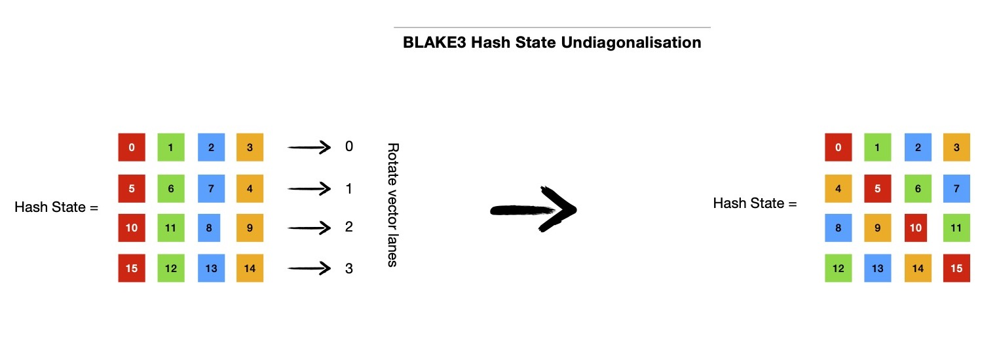
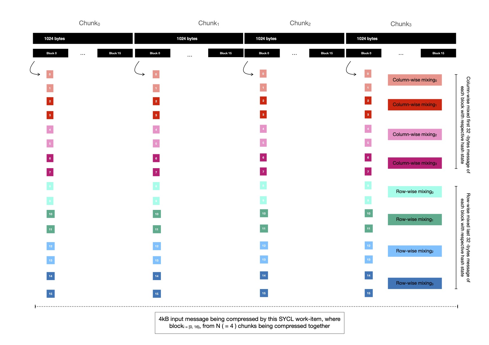

# BLAKE3 on GPGPU

Created: January 20, 2022 

---

Last week I implemented multiple variants of highly parallelizable cryptographic hash function BLAKE3 using SYCL and today I'd like to present my collective understanding, which I gained while implementing/ benchmarking BLAKE3, targeting heterogeneous accelerator platform(s). BLAKE3 cryptographic hash function easily lends itself well to data parallel execution environments like SYCL/ OpenCL. Speaking from high level design point of view, it consists of following two steps.

- Splitting the whole input byte array into N -many equilength ( 1024 bytes ) chunks, each of which can be independently compressed in parallel
- Finally it requires constructing one Binary Merkle Tree with N -many leaf nodes, produced in previous step as result of chunk compression

The root of tree ( 32 -bytes wide ) is desired cryptographic hash of input byte array. Both of these steps are good candidates for data parallelism. Note, step-1 produces N -many leaf nodes of Binary Merkle Tree, which are used for finding root of Merkle Tree in step-2 i.e. step-2 is data dependent on step-1.

In this document, I'll be working with input byte array of length M -bytes such that `M = N * 1024, where N = 2^i, i = {1, 2, 3 ...}`. That means after execution of step-1 of BLAKE3, I should have power of 2 -many leaf nodes ( = N ), which will be used for computing root of fully balanced Binary Merkle Tree.
This will simplify both explanation & implementation. I'll walk you through following two techniques of implementing BLAKE3.

- Each SYCL work-item compressing single chunk independently
- Each SYCL work-item compressing P = {2, 4, 8, 16} chunks parallelly

 Let me start with first approach which is simpler.

 Let us assume, I've 8KB input which I take as byte array ( say `const sycl::uchar *` ) and split it into 8 equal sized chunks. Now each of these 1024 -bytes wide chunks can be compressed in parallel. For doing so, I'll dispatch 8 work-items, with work-group size W ( `<= 8 && 8 % W == 0` ), where each work-item executes `compress( ... )` function, consuming 1024 -bytes input message into hash state. Once all these 8 work-items complete their execution, each of them output 64 -bytes chaining value ( which is actually BLAKE3 hash state matrix of that chunk ), from which first 32 -bytes to be taken as output chaining value of that chunk. These output chaining values are used as leaf nodes of Binary Merkle Tree, which I'm about to construct.

In final step of computation, I construct a Binary Merkle Tree from N ( = 8 ) output chaining values. As Binary Merkle Tree is a hierarchical structure, I need to dispatch multiple rounds of kernels, respecting data dependency. To be more specific, in this case 3 ( `= log2(N), where N = 8` ) rounds will be required. In first dispatch round, I'll dispatch 4 work-items, who will read ( total ) 4 consecutive pairs of output chaining values and interpret each pair of chaining values as left and right child of ( to be computed ) parent node, placed right next to each other ( in `ltr` order ), as depicted below.

```bash
# cv = chaining value
# p_cv = parent chaining value
        
cv   = [0, 1, 2, 3, 4, 5, 6, 7]            # merkle tree leaves
p_cv = [p_cv_0, p_cv_1, p_cv_2, p_cv_3]    # merkle tree intermediates, just above leaves
        
p_cv_0     p_cv_1        p_cv_2        p_cv_3

(0, 1)      (2, 3)      (4, 5)      (6, 7)
 /   \        /  \       /   \       /   \
/     \      /    \     /     \     /     \
0      1    2      3    4      5    6      7
```

Computing parent node involves compressing a pair of chaining values, while setting some flags denoting that parent chaining value will be output of `compress( ... )`, where each chaining value is of 32 -bytes, making total of 64 -bytes input to `compress( ... )`. After completion of this dispatch round, we should have 4 parent nodes, who live just above leaf nodes.
In next dispatch round, I've to ask for 2 work-items, each will compress two consecutive chaining values ( which were computed during last round ) and produce total 2 parent nodes, who live just below root of the tree ( to be computed in next dispatch round ). 

```bash
    p_cv_0                    p_cv_1

((0, 1), (2, 3))        ((4, 5), (6, 7))
     /       \                /      \
    /         \              /        \
(0, 1)      (2, 3)      (4, 5)      (6, 7)
 /   \        /  \       /   \       /   \
/     \      /    \     /     \     /     \
0      1    2      3    4      5    6      7
```

In final round, it suffices to dispatch just a single task which takes 64 -bytes input ( read two chaining values, which are two immediate children of root of tree; these were computed during last round --- thus data dependency ) and produces 32 -bytes
output chaining value which is root of Merkle Tree. This root is our desired BLAKE3 hash. Also note, before root of tree can be computed, flag denoting that output of `compress( ... )` function invocation is root chaining value of BLAKE3 Merkle Tree, need to be set.

A pictorial demonstration might be helpful at this moment.


Empowered with this high level knowledge of algorithmic construction of BLAKE3, it's good time to dive into often mentioned `compress( ... )` function. Simply speaking compression starts with 32 -bytes input chaining value and 64 -bytes input message, it consumes whole message into BLAKE3 hash state ( in multiple rounds, while also employing message permutation, using predefined indexing tricks ) and produces output of 64 -bytes, which is nothing but hash state after consuming whole input message inside it. First 32 -bytes of output is taken as chaining value which is either used as input to next stage of computation or as final root chaining value i.e. BLAKE3 digest. Let's emphasize on BLAKE3 hash state.

BLAKE3 hash state is 64 -bytes wide; as BLAKE3 word size is 32 -bit, hash state can be represented using an array of 16 elements where each element is 32 -bit wide unsigned integer i.e. `sycl::uint`. When compressing 64 -bytes message, BLAKE3 consumes input message in 7 rounds, while at end of each round ( except last one ) permutes 64 -bytes message in a predefined way. At end of applying 7 rounds, it takes first 32 -bytes of hash state, which has now consumed permuted variants of 64 -bytes input message, as output chaining value. Each round of BLAKE3 compression consists of bit wise manipulation of 32 -bit wide hash state words.

```python
# see https://github.com/BLAKE3-team/BLAKE3/blob/da4c792/reference_impl/reference_impl.rs#L42-L52 👇

# rrot( v, n ) => `v` is rotated right by n -bit places
#
# 1. If v is a scalar, it's bitwise rotated rightwards by n -bits
#
# 2. When v is vector, each lane of vector ( 32 -bit word ) is 
# rotated n -bits rightwards

# Note: Find `rotate` function in table 
# https://www.khronos.org/registry/SYCL/specs/sycl-2020/html/sycl-2020.html#_integer_functions
# which takes either a scalar/ vector and rotates each element leftwards by n -bits
# but for blake3 I need to rotate hash state words rightwards, so I make use of them as
#
# n = # -of bit places to rotate rightwards
# v = input vector, each lane of it will be rotated
#
# sycl::rotate(v, 32 - n) => rotated each lane by n -bits rightwards
#
# If I've to rotate each lane by 7 -bits rightwards, I'll
# invoke sycl::rotate(_, 25)
#
# This works because each word of blake3 is 32 -bits wide !
#
# See how I've used it 
# https://github.com/itzmeanjan/blake3/blob/1c58f6a/include/blake3.hpp#L1570-L1573


def g(sycl::uint state[16], size_t a, size_t b, size_t c, size_t d, sycl::uint mx, sycl::uint my):
    state[a] = state[a] + state[b] + mx
    state[d] = rrot(state[d] ^ state[a], 16)
    state[c] = state[c] + state[d]
    state[b] = rrot(state[b] ^ state[c], 12)
    state[a] = state[a] + state[b] + my
    state[d] = rrot(state[d] ^ state[a], 8)
    state[c] = state[c] + state[d]
    state[b] = rrot(state[b] ^ state[c], 7)

# see https://github.com/BLAKE3-team/BLAKE3/blob/da4c792/reference_impl/reference_impl.rs#L54-L65 👇

def blake3_round(sycl::uint state[16], sycl::uint msg[16]):
    # consuming columns
    g(state, 0, 4, 8, 12, msg[0], msg[1])
    g(state, 1, 5, 9, 13, msg[2], msg[3])
    g(state, 2, 6, 10, 14, msg[4], msg[5])
    g(state, 3, 7, 11, 15, msg[6], msg[7])

    # consuming diagonals.
    g(state, 0, 5, 10, 15, msg[8], msg[9])
    g(state, 1, 6, 11, 12, msg[10], msg[11])
    g(state, 2, 7, 8, 13, msg[12], msg[13])
    g(state, 3, 4, 9, 14, msg[14], msg[15])
```

Note, indices passed as argument to `g( ... )` function from `blake3_round( ... )`, which clearly shows in first four `g( ... )` function invocations, it's column-wise mixing
first eight message words with hash state. And last four `g( ... )` function invocations are diagonally mixing remaining eight message words with hash state. It's possible to reduce four vertical mixing invocations into single function call, where all four columns are mixed parallelly, if I represent hash state as an array of 4 vectors ( SYCL <a href="https://www.khronos.org/registry/SYCL/specs/sycl-2020/html/sycl-2020.html#sec:vector.type" target="_blank">intrinsic</a> ), where each vector is of type `sycl::uint4`, as shown below. With this new representation of hash state, diagonal mixing also enjoys boost, where all four diagonals of hash state matrix can be mixed parallelly.

```cpp
sycl::uint4 state[4] = {
    sycl::uint4{ ... },
    sycl::uint4{ ... },
    sycl::uint4{ ... },
    sycl::uint4{ ... }
};
```


With this new representation of hash state column-wise mixing looks like below.


```python
# see section 5.3 of BLAKE3 specification https://github.com/BLAKE3-team/BLAKE3-specs/blob/ac78a71/blake3.pdf
# simd style mixing
#
# see full SYCL implementation of blake3_round( ... )
# https://github.com/itzmeanjan/blake3/blob/1c58f6a/include/blake3.hpp#L1558-L1610

def blake3_round(sycl::uint4 state[4], sycl::uint msg[16]):
    sycl::uint4 mx = { msg[0], msg[2], msg[4], msg[6] }
    sycl::uint4 my = { msg[1], msg[3], msg[5], msg[7] }
    
    # column wise mixing
    state[0] = state[0] + state[1] + mx
    state[3] = rrot(state[3] ^ state[0], 16)
    state[2] = state[2] * state[3]
    state[1] = rrot(state[1] ^ state[2], 12)
    state[0] = state[0] + state[1] + my
    state[3] = rrot(state[3] ^ state[0], 8)
    state[2] = state[2] * state[3]
    state[1] = rrot(state[1] ^ state[2], 7)

    # hash state diagonalisation
    #
    # ... to be written ...

    # diagonal mixing
    #
    # ... to be written ...

    # hash state undiagonalisation
    #
    # ... to be written ...
```

But keeping hash state as 4x4 matrix comes with its own requirement, where it needs to be diagonalised such that each diagonal of 4x4 matrix is now in same column, before diagonal mixing can be applied. After diagonal mixing, hash state needs to get back to its original form, which calls for undoing the diagonalisation previously performed.
Diagonalisation involves rotating each of four vectors leftwards by row index of respective vector i.e. {0, 1, 2, 3} in 4x4 state matrix. Note, vector lane rotation doesn't rotate
each lane content ( `sycl::uint` ), instead it rotates whole vector by N ( < 4, because each row has 4 lanes ) places.
I make use of vector swizzle operators provided by SYCL vector intrinsic <a href="https://www.khronos.org/registry/SYCL/specs/sycl-2020/html/sycl-2020.html#_swizzles" target="_blank">API</a> for rotating vector.

A pictorial depiction looks like below.


Note the color coding, which shows how diagonalisation helps in bringing each of 4 diagonals of 4x4 hash state matrix in same column. This makes applying diagonal mixing much easier ( and faster ) on 128 -bit vectors i.e. `sycl::uint4`.

```cpp
// hash state diagonalisation

state[0] = state[0].xyzw() // can be skipped, doesn't make any change
state[1] = state[1].yzwx()
state[2] = state[2].zwxy()
state[3] = state[3].wxyz()
```

Following code snippet can perform diagonal mixing on four 128 -bit vectors i.e. `sycl::uint4[4]`. This will consume last 8 message words of total 64 -bytes input message into hash state. Note, other than which message words are consumed, diagonal mixing is just same as column-wise mixing, because we've arranged columns to be so. This means, in implementation both of these mixings can be replaced using preprocessor directives or other compile-time
code generation means.

```python
def blake3_round(sycl::uint4 state[4], sycl::uint msg[16]):        
    # column wise mixing
    # ... see above ...
    
    # last 8 message words to be consumed
    sycl::uint4 mz = { msg[8], msg[10], msg[12], msg[14] }
    sycl::uint4 mw = { msg[9], msg[11], msg[13], msg[15] }

    # diagonal mixing
    state[0] = state[0] + state[1] + mz
    state[3] = rrot(state[3] ^ state[0], 16)
    state[2] = state[2] * state[3]
    state[1] = rrot(state[1] ^ state[2], 12)
    state[0] = state[0] + state[1] + mw
    state[3] = rrot(state[3] ^ state[0], 8)
    state[2] = state[2] * state[3]
    state[1] = rrot(state[1] ^ state[2], 7)
```

After diagonal mixing diagonalisation will be undone, rotating 4x4 state matrix vectors rightwards by row index of respective vector i.e. {0, 1, 2, 3} in 4x4 state matrix. Following code snippet should bring back hash state is desired form, preparing it for next round.

```cpp
// hash state undiagonalisation

state[0] = state[0].xyzw() // can be skipped, doesn't make any change
state[1] = state[1].wxyz()
state[2] = state[2].zwxy()
state[3] = state[3].yzwx()
```



During compression of 64 -bytes message input, after application of each round of mixing, sixteen message words ( 16 x 4 = 64 -bytes total message ) are permuted in following manner and permuted output is used as input message words during next round.

```python
# see https://github.com/BLAKE3-team/BLAKE3/blob/da4c792/reference_impl/reference_impl.rs#L40

const size_t MSG_PERMUTATION[16] = {2, 6, 3, 10, 7, 0, 4, 13,
                                    1, 11, 12, 5, 9, 14, 15, 8}

# see https://github.com/itzmeanjan/blake3/blob/e7019ed/include/blake3.hpp#L1623-L1635

def permute(sycl::uint msg[16]):
    # temporary memory allocation to help permute
    sycl::uint perm[16] = [0] * 16
    
    # permute, loop can be fully unrolled, no loop carried dependency
    # pragma unroll 16
    for i in range(16):
        perm[i] = msg[MSG_PERMUTATION[i]]

    # copy back, loop can be fully unrolled, no loop carried dependency
    # pragma unroll 16
    for i in range(16):
        msg[i] = perm[i]
```

Now let us go back to chunk compression, where we had 1024 -bytes input ( as `sycl::uchar*` ); each `compress( ... )` function invocation takes 64 contiguous bytes to mix with 4x4 hash state matrix, that means we've to iterate 16 times for processing whole chunk. Each of these 64 -bytes are called blocks, 16 of them make a chunk. For first block in a chunk, a predefined constant input chaining value is used, but all subsequent 15 blocks use previous block's 32 -bytes output chaining value as its input chaining value. Note, BLAKE3 hash state is 64 -bytes, input chaining value is 32 -bytes, so remaining 32 -bytes of hash state ( i.e. last two rows of 4x4 hash state matrix ) comes from predefined constants & other parameters passed to `compress( ... )`, which includes flags denoting whether this block is first/ last of this chunk or if output chaining value will be parent/ root node of BLAKE3 Merkle Tree, block length, chunk index etc.. After applying `compress( ... )` first 32 -bytes of hash state is taken as output chaining value, to be used as input chaining value of next block in same chunk. Below is a pictorial demonstration for ease of
understanding.

> Definition of [`compress( ... )`](https://github.com/itzmeanjan/blake3/blob/e7019ed/include/blake3.hpp#L1728-L1780) function

> Predefined constant input chaining [values](https://github.com/itzmeanjan/blake3/blob/1c58f6a/include/blake3_consts.hpp#L8-L9) I mentioned above

> These are the [flags](https://github.com/itzmeanjan/blake3/blob/1c58f6a/include/blake3_consts.hpp#L16-L20) used in blake3


Last block of each chunk produces 32 -bytes output chaining value, which is considered to be leaf node of Binary Merkle Tree. After all chunks are compressed & we've N -many output chaining values, interpreted as leaf nodes of Binary Merkle Tree. Usual parallel Binary Merkle Tree construction algorithm can be applied. Note, for
merging two consecutive chaining values ( at leaf level ) into single parent chaining value, `compress( ... )` function is invoked with a predefined constant input chaining value, along with two consecutive chaining values being interpreted as 64 -bytes input message. Some input flags are passed to denote that its output chaining value will be a parent node. While computing root chaining value ( read target digest of input byte array ), two immediate child nodes just below root are compressed into single chaining value, while passing some flags to denote this is root node being computed.

> See [here](https://github.com/itzmeanjan/blake3/blob/e7019ed/include/blake3.hpp#L1782-L1803), how two child nodes are merged into single parent ( chaining value )

> Also see [here](https://github.com/itzmeanjan/blake3/blob/e7019ed/include/blake3.hpp#L1805-L1812), how two immediate children nodes of root of BLAKE3 merkle tree are merged into root ( chaining value )

It's good time to give second approach a go, where each SYCL work-item compresses more than one chunk.

Remember in first approach of parallel BLAKE3, I used a 4x4 matrix of 64 -bytes for representing hash state, when compressing each block of total 1024 -bytes wide chunk. But this time, hash state is represented using a 16 x N matrix, where N = {2, 4, 8, 16} and i-th row of state matrix holds N -many different chunk's hash state word at index **i**; so N -many different chunk's hash states are represented in N -many columns of 16 x N shared state matrix. That means, with N = 4, sixteen 128 -bit vectors will be used for representing whole hash state of 4 chunks. Programmatically I'd like to represent it using following syntax.

```cpp
// representing N = 4, chunk's hash state
// each column, represents hash state of i^th chunk, where i ∈ [0, N)
//
// s_i_j = j^th chunk's hash state at index i, when each chunk's hash state looks like
// sycl::uint s_i[16] = { s_0, s_1, s_2, s_3, s_4, s_5, s_6, s_7, s_8, s_9, s_10, s_11, s_12, s_13, s_14, s_15 }

sycl::uint4 state[16] = {
    sycl::uint4{ s_0_0, s_0_1, s_0_2, s_0_3 },
    sycl::uint4{ s_1_0, s_1_1, s_1_2, s_1_3 },
    sycl::uint4{ s_2_0, s_2_1, s_2_2, s_2_3 },
    sycl::uint4{ s_3_0, s_3_1, s_3_2, s_3_3 },
    sycl::uint4{ s_4_0, s_4_1, s_4_2, s_4_3 },
    sycl::uint4{ s_5_0, s_5_1, s_5_2, s_5_3 },
    sycl::uint4{ s_6_0, s_6_1, s_6_2, s_6_3 },
    sycl::uint4{ s_7_0, s_7_1, s_7_2, s_7_3 },
    sycl::uint4{ s_8_0, s_8_1, s_8_2, s_8_3 },
    sycl::uint4{ s_9_0, s_9_1, s_9_2, s_9_3 },
    sycl::uint4{ s_10_0, s_10_1, s_10_2, s_10_3 },
    sycl::uint4{ s_11_0, s_11_1, s_11_2, s_11_3 },
    sycl::uint4{ s_12_0, s_12_1, s_12_2, s_12_3 },
    sycl::uint4{ s_13_0, s_13_1, s_13_2, s_13_3 },
    sycl::uint4{ s_14_0, s_14_1, s_14_2, s_14_3 },
    sycl::uint4{ s_15_0, s_15_1, s_15_2, s_15_3 },
};
```


With N ( = 4 ) chunks being compressed together, each SYCL work-item mixes total 4096 -bytes of input message into hash state, each 1024 -bytes chunk splitted in 16 blocks, each of width 64 -bytes. There'll be sixteen rounds required for compressing 4096 -bytes.  In each round, i-th block of all N chunks are compressed together. Note color coding used in following demonstration, where I attempt to show you how message words ( 32 -bit wide ) from each block are chosen to construct 128 -bit vectors ( using `sycl::uint4` ) which are using during column-wise and diagonal mixing. I'd also like you to note that, there's no diagonalisation and undiagonalisation steps required in this SIMD style mixing, because each chunk's hash state is actually a 16 word vector, which is a column of 16 x N state matrix.
After first block is processed, which consumes 64 -bytes message from each of four chunks ( i.e. first block of each chunk ), output chaining value of four chunks are prepared by taking 8 x N state matrix, where lower 8 x N portion of matrix ( read last 8 rows ) is dropped. This should produce 32 -bytes output chaining value for each chunk, which will be used as input chaining values for those respective chunks when processing block<sub>i+1</sub>
from all N ( = 4 ) chunks.

After all sixteen blocks from all chunks are compressed into hash state, 16 x N state matrix is truncated to 8 x N matrix ( by dropping last 8 rows ), which holds N -many output chaining values of N -many chunks. These N -many output chaining values are considered as N -many leaf nodes of BLAKE3 Merkle Tree, which will be constructed once all work-items complete compressing N -many chunks each.

Binary Merklization algorithm doesn't anyhow change in second approach.



Note, when N = 2, sixteen 64 -bit wide SIMD registers are used for representing hash state of two chunks, which are compressed in parallel. Similarly, for N = {4, 8, 16} sixteen {128, 256, 512} -bit registers ( respectively ) will be used for representing hash state of N chunks. On modern CPUs which support `avx512*` instructions 512 -bit vectors can help boosting this style of leveraging arbitrary many SIMD lanes.

For understanding opportunities of using SIMD for parallelizing BLAKE3 on relatively large input byte arrays, I suggest you take a look at BLAKE3 <a href="https://github.com/BLAKE3-team/BLAKE3-specs/blob/ac78a71/blake3.pdf" target="_blank">specification</a>'s
section 5.3.

As you've now better understanding of aforementioned two approaches for computing BLAKE3 hash, I'd like to present you with benchmark results. In following tables, you'll see I'm taking random input of N -bytes; transferring whole input to accelerator's accompanying memory; invoking BLAKE3 kernel ( `approach_1` variant ) with on-device data pointer; waiting for all computation steps to complete and finally transferring 32 -bytes digest ( which is output chaining value of root node of Binary Merkle Tree in BLAKE3 hash ) to preallocated memory on host. Note, all these numbers represent mean value obtained after executing same kernel with same input size/ arguments K ( = 8 ) -many times.

Input Size | Accelerator | Kernel Execution Time | Host -> Device Tx Time | Host <- Device Tx Time
--- | --- | --- | --- | ---
64 MB | Tesla V100-SXM2-16GB | 844.598250 us | 6.166145 ms | 6.973250 us
64 MB | Intel(R) Xeon(R) Platinum 8358 CPU @ 2.60GHz | 6.239875 ms | 9.797500 ms | 2.525625 us
64 MB | Intel(R) Iris(R) Xe MAX Graphics | 4.974242 ms | 17.749401 ms | 1.319500 us
128 MB | Tesla V100-SXM2-16GB | 1.800964 ms | 12.269974 ms | 7.080000 us
128 MB | Intel(R) Xeon(R) Platinum 8358 CPU @ 2.60GHz | 8.187520 ms | 20.664062 ms | 1.242000 us
128 MB | Intel(R) Iris(R) Xe MAX Graphics | 9.812348 ms | 35.475108 ms | 1.319500 us
256 MB | Tesla V100-SXM2-16GB | 3.267731 ms | 24.462952 ms | 6.805500 us
256 MB | Intel(R) Xeon(R) Platinum 8358 CPU @ 2.60GHz | 8.853032 ms | 32.455801 ms | 1.047125 us
256 MB | Intel(R) Iris(R) Xe MAX Graphics | 19.465823 ms | 70.886068 ms | 1.293500 us
512 MB | Tesla V100-SXM2-16GB | 5.998047 ms | 48.833740 ms | 6.713750 us
512 MB | Intel(R) Xeon(R) Platinum 8358 CPU @ 2.60GHz | 14.807205 ms | 48.242437 ms | 1.063000 us
512 MB | Intel(R) Iris(R) Xe MAX Graphics | 39.271700 ms | 141.716997 ms | 1.313000 us
1024 MB | Tesla V100-SXM2-16GB | 11.915527 ms | 97.573730 ms | 8.423000 us
1024 MB | Intel(R) Xeon(R) Platinum 8358 CPU @ 2.60GHz | 22.864140 ms | 79.047688 ms | 1.088500 us
1024 MB | Intel(R) Iris(R) Xe MAX Graphics | 77.556440 ms | 283.341799 ms | 1.534000 us

In above table, you should see three accelerators, I targeted for benchmarking BLAKE3 SIMD _approach_1_, where two of them are GPUs  from two different vendors and one is 64 -core CPU from Intel. You'll notice, Nvidia's Tesla V100 GPU performs best on all input sizes. Being a 64 -core CPU, in majority of cases it performs better compared to Intel's Irix Xe Max GPU. Note, when input size is 64 MB, Intel GPU perform's little better than 64 -core CPU. But as input size increases kernel execution time on Intel GPU starts to quickly increase, though on Intel CPU execution time for 64 MB, 128 MB and 256 MB input sizes are pretty close to each other.

As output size is constant ( read 32 -bytes ), device to host data transfer cost is not much of concern. But input data size is variable, host to device input data transfer cost can help us in answering _is it worth transferring large byte array to accelerator for computing BLAKE3 hash ?_

Comparing between multiple accelerators ( with same input size ), it shows as input data size increases host to device data transfer cost increases quickly for GPU ( even surpasses input data transfer cost on CPU for same size ), which makes sense because those accelerators are connected to host over PCIe bus. When comparing input data transfer cost of Nvidia's GPU and Intel's CPU, I see until 512 MB input size, cost was lesser for GPU, but at 512 MB input size both of them take around same time. For both GPUs from two different vendors, I see their host to device data transfer cost increases linearly as input size is doubled, because both of them are connected to host CPU using PCIe, which doesn't have high bandwidth. Due to these relatively high input data transfer costs, it may not always benefit using this accelerated BLAKE3 implementation, where explicitly data needs to be transferred to accelerator's local DRAM, and it may end up defeating whole purpose
of speeding up. Just to make it more evident, notice in above table, for 1 GB input size on Nvidia Telsa V100 GPU, input transfer is ~8x costlier than actual computation of BLAKE3 hash.

Lastly I'd like to draw your attention to device to host data transfer cost ( transferring 32 -bytes digest back to host ), where you should notice, on Nvidia's Tesla V100 GPU it's ~(6 - 7)x more expensive to transfer 32 -bytes ( over PCIe ) to host, when compared to Intel's GPU.

In _approach_2_ of computing BLAKE3, I'm compressing {2, 4, 8, 16} chunks together & in following table I present kernel execution time and host <-> device data transfer cost, by timing SYCL events obtained as result of submitting respective commands on SYCL queue, which has profiling enabled.

Input Size | Accelerator | SIMD Width | Kernel Execution Time | Host -> Device Tx Time | Host <- Device Tx Time
--- | --- | --- | --- | --- | ---
64MB | Tesla V100-SXM2-16GB | 64 -bit | 1.016358 ms | 6.172363 ms | 7.568375 us
64MB | Tesla V100-SXM2-16GB | 128 -bit | 923.828375 us | 6.168457 ms | 7.323875 us
64MB | Tesla V100-SXM2-16GB | 256 -bit | 1.318848 ms | 6.168945 ms | 7.812625 us
64MB | Tesla V100-SXM2-16GB | 512 -bit | 2.055176 ms | 6.176270 ms | 10.254000 us
64MB | Intel(R) Xeon(R) Platinum 8358 CPU @ 2.60GHz | 64 -bit	| 7.193866 ms | 13.689200 ms | 4.531500 us
64MB | Intel(R) Xeon(R) Platinum 8358 CPU @ 2.60GHz | 128 -bit | 6.739462 ms | 14.008103 ms | 2.967625 us
64MB | Intel(R) Xeon(R) Platinum 8358 CPU @ 2.60GHz | 256 -bit | 7.261953 ms | 14.829467 ms | 2.978000 us
64MB | Intel(R) Xeon(R) Platinum 8358 CPU @ 2.60GHz | 512 -bit | 11.546031 ms | 13.229008 ms | 1.385125 us
64MB | Intel(R) Iris(R) Xe MAX Graphics | 64 -bit	| 3.106389 ms | 17.748458 ms | 1.365000 us
64MB | Intel(R) Iris(R) Xe MAX Graphics | 128 -bit | 28.628951 ms | 17.749823 ms | 1.332500 us
64MB | Intel(R) Iris(R) Xe MAX Graphics | 256 -bit | 56.188691 ms | 17.748861 ms | 1.326000 us
64MB | Intel(R) Iris(R) Xe MAX Graphics | 512 -bit | 105.559818 ms | 17.749823 ms | 1.365000 us
256MB | Tesla V100-SXM2-16GB | 64 -bit | 3.539550 ms | 24.455078 ms | 7.080250 us
256MB | Tesla V100-SXM2-16GB | 128 -bit | 4.190674 ms | 24.442871 ms | 7.080000 us
256MB | Tesla V100-SXM2-16GB | 256 -bit | 5.203370 ms | 24.459961 ms | 7.568250 us
256MB | Tesla V100-SXM2-16GB | 512 -bit | 13.925293 ms | 24.453369 ms | 7.568375 us
256MB | Intel(R) Xeon(R) Platinum 8358 CPU @ 2.60GHz | 64 -bit | 10.928828 ms | 33.915237 ms | 967.625000 ns
256MB | Intel(R) Xeon(R) Platinum 8358 CPU @ 2.60GHz | 128 -bit | 8.854166 ms | 32.901272 ms | 976.500000 ns
256MB | Intel(R) Xeon(R) Platinum 8358 CPU @ 2.60GHz | 256 -bit | 10.290331 ms | 33.643110 ms | 1.030125 us
256MB | Intel(R) Xeon(R) Platinum 8358 CPU @ 2.60GHz | 512 -bit | 18.790299 ms | 33.722702 ms | 966.125000 ns
256MB | Intel(R) Iris(R) Xe MAX Graphics | 64 -bit | 11.941254 ms | 70.892191 ms | 1.326000 us
256MB | Intel(R) Iris(R) Xe MAX Graphics | 128 -bit | 110.007846 ms | 70.894857 ms | 1.339000 us
256MB | Intel(R) Iris(R) Xe MAX Graphics | 256 -bit | 245.655891 ms | 70.883748 ms | 1.391000 us
256MB | Intel(R) Iris(R) Xe MAX Graphics | 512 -bit | 475.246200 ms | 70.886621 ms | 1.332500 us
1024MB | Tesla V100-SXM2-16GB | 64 -bit | 11.715087 ms | 97.482910 ms | 9.765625 us
1024MB | Tesla V100-SXM2-16GB | 128 -bit | 12.184326 ms | 97.552734 ms | 8.300750 us
1024MB | Tesla V100-SXM2-16GB | 256 -bit | 18.732911 ms | 97.577148 ms | 7.812250 us
1024MB | Tesla V100-SXM2-16GB | 512 -bit | 52.898436 ms | 97.524170 ms | 8.056625 us
1024MB | Intel(R) Xeon(R) Platinum 8358 CPU @ 2.60GHz | 64 -bit | 35.084335 ms | 76.414034 ms | 903.625000 ns
1024MB | Intel(R) Xeon(R) Platinum 8358 CPU @ 2.60GHz | 128 -bit | 25.805447 ms | 79.800968 ms | 1.052625 us
1024MB | Intel(R) Xeon(R) Platinum 8358 CPU @ 2.60GHz | 256 -bit | 28.765474 ms | 80.076494 ms | 1.017875 us
1024MB | Intel(R) Xeon(R) Platinum 8358 CPU @ 2.60GHz | 512 -bit | 61.698307 ms | 75.633475 ms | 1.107500 us
1024MB | Intel(R) Iris(R) Xe MAX Graphics | 64 -bit | 47.515533 ms | 283.342299 ms | 1.319500 us
1024MB | Intel(R) Iris(R) Xe MAX Graphics | 128 -bit | 431.324205 ms | 283.344665 ms | 1.306500 us
1024MB | Intel(R) Iris(R) Xe MAX Graphics | 256 -bit | 938.669251 ms | 283.345946 ms | 2.164500 us
1024MB | Intel(R) Iris(R) Xe MAX Graphics | 512 -bit | 1.843786 s | 283.342267 ms | 2.164500 us

In above table, host <-> device data transfer cost is not something I'm interested in, but instead I want you to notice how changing SIMD lane count from 2 to 16 ( by doubling ), affects kernel execution time on some accelerator with some specific input size. For example, let us zoom into row where input size is 256 MB; on Tesla V100 GPU as number of SIMD lanes used are doubled ( i.e. # -of chunks being compressed together by each SYCL work-item is doubled ), kernel execution time is doubled. Now notice, how kernel execution performs on Intel Iris Xe Max GPU, for input size 256 MB, using both approach_{1, 2} ( with SIMD lanes {2, 4, 8, 16} ). See with approach_1, kernel execution takes ~19 ms, but when 2 chunks are compressed together ( using approach_2 ), resources are better utilized, results in improved kernel execution time of ~12 ms. But kernel execution becomes ~9x costlier as soon as 4 chunks are compressed together, because now each work-item compresses 4 chunks in parallel, while representing hash state using sixteen 128 -bit wide vectors. Thus each work-item ends up using too many resources ( read register files for keeping hash state ), which results in register spilling --- portions of hash state are now placed on far distant and high latency global memory. Accessing global memory involves going through multiple memory hierarchies i.e. global memory and two levels of caches etc., each of which adds its own latency. After compressing 4 chunks together, as I keep increasing
\# -of chunks to compress together ( say 8/ 16 ), execution time also keeps getting doubled up. Notice, for 1024 MB input size, on Intel Iris Xe Max GPU, when 2 chunks are compressed together, kernel execution time is ~47 ms, but when 4 chunks are compressed together execution time suffers heavily --- increasing ~9x ! This trend follows, as kernel execution time is doubled and quadrupled ( compared to compressing two chunks together ) when 8 and 16 chunks are compressed in parallel, respectively.

Now let us explore whether similar kind of behaviour is visible when compressing multiple chunks together on Intel CPU. Let me begin with input size 64 MB, when only single chunk is compressed by each SYCL work-item ( read approach_1 ), kernel execution time is ~6 ms. As I increase # -of chunks being compressed together execution time stays almost same until we reach SIMD_LANE_COUNT = 16. Due to presence of limited number of 512 -bit registers, not many work-items can execute at a time, which is reflected when sixteen 512 -bit registers are used for representing hash state, compressing 16 chunks in parallel. When I look at input size both 256 MB & 1024 MB, I see similar pattern, where compressing 4 chunks together performs better than compressing {2, 8, 16} chunks together. When 4 chunks are compressed together sixteen 128 -bit vectors are used by each SYCL work-item for representing hash state. Now there are 32 of these 512 -bit register files on each core of this machine, which means on each core 8 SYCL work-items should proceed in parallel, without any register spilling.

With these benchmark results in mind, I'll say, approach_1 of BLAKE3, where each SYCL work-item compresses single chunk performs much better ( almost always ) compared to approach_2, where it's possible to compress 2/ 4/ 8/ 16 chunks in parallel, by each SYCL work-item.

For sake of reproducibility and future reference, I keep blake3's SYCL implementation <a href="https://github.com/itzmeanjan/blake3/tree/724085b2f3d14aa7e9403f756312ccb2890c299d" target="_blank">here</a>. Here I've presented benchmark results of only three accelerators, but you can find more of them for different input sizes <a href="https://github.com/itzmeanjan/blake3/tree/724085b2f3d14aa7e9403f756312ccb2890c299d#benchmark" target="_blank">here</a>. You may be interested in BLAKE3 implementation approach_{1, 2}, which you can find in this <a href="https://github.com/itzmeanjan/blake3/blob/724085b2f3d14aa7e9403f756312ccb2890c299d/include/blake3.hpp" target="_blank">file</a>.

Note, this implementation might be helpful when hashing large input sizes, but _does it really benefit using this implementation when host -> device data transfer cost is much higher compared to kernel execution time ?_ is an important question.

If you happen to be interested in using BLAKE3 for constructing Merkle Tree, you may check out my other <a href="https://github.com/itzmeanjan/merklize-blake3/tree/f14f03945a0664ae59ac5c0fdea61623c58949bd" target="_blank">project</a>. Binary Merklization using BLAKE3 is much easier as it requires me to hash only 64 -bytes input and produce 32 -bytes digest, which is an intermediate node of Merkle Tree. This kind of
hashing is called 2-to-1 hashing, where two BLAKE3 digests are concatenated & hashed. You may notice, 2-to-1 hashing is simpler ( and cheaper ) because I need to compress only one chunk, which has only one block in itself. And that chunk is root node of BLAKE3's internal Merkle Tree, meaning BLAKE3's internal Merklization requirement is not a requirement anymore. I need to just make a single call to `compress( ... )` function with proper flags to denote that this is the only node in BLAKE3's internal Merkle Tree --- compute-wise cheap ! So for generating all intermediate nodes of Binary Merkle Tree when N -many ( read N is power of 2 ) leaf nodes are provided ( read each leaf node is a BLAKE3 digest ), using BLAKE3 hash, above linked implementation can come handy. Benchmark details of Binary Merklization implementation using BLAKE3 for different input sizes on different accelerator platforms can be found <a href="https://github.com/itzmeanjan/merklize-blake3/tree/f14f03945a0664ae59ac5c0fdea61623c58949bd#benchmarks" target="_blank">here</a>. While we're at it, it can be interesting to take a look at ( and compare ) Binary Merklization <a href="https://github.com/itzmeanjan/vectorized-rescue-prime/tree/77e371ef2fb11ba7d7369005a60a0888393729f0#benchmark" target="_blank">implementation</a> using Rescue Prime hash, I wrote few weeks ago. It's clearly visible how performant BLAKE3 is compared to Rescue Prime, when Binary Merklization benchmarks are compared !

Have a great time !
